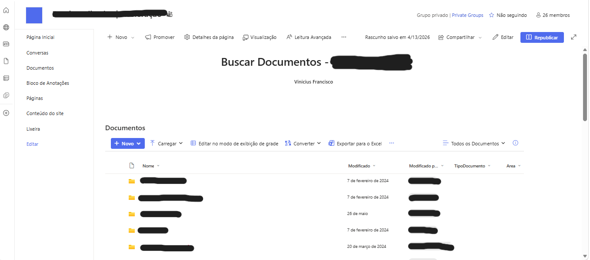

# 📂 Buscador de Documentos – Projeto REMIN

## 📌 Visão Geral

O **Buscador de Documentos – Projeto REMIN** é uma solução corporativa baseada em SharePoint, desenvolvida para otimizar a busca e recuperação de documentos dentro do Microsoft Teams.

A solução utiliza recursos nativos do SharePoint, como bibliotecas de documentos e metadados estruturados, permitindo uma busca rápida e eficiente sem necessidade de desenvolvimento de código.

---

## 🎯 Objetivo

- Reduzir o tempo de busca por documentos  
- Melhorar a organização das informações  
- Aumentar a produtividade da equipe  

---

## 🚀 Funcionalidades

- 🔍 Busca por nome de arquivo  
- 📄 Busca por conteúdo dos documentos  
- 🏷️ Filtros por:
  - Tipo  
  - Data  
  - Autor  
  - Área  
- 📂 Organização estruturada por pastas  
- ⚡ Busca rápida via SharePoint  
- 🌐 Acesso integrado ao Teams  

---

## 🏗️ Tecnologias Utilizadas

- Microsoft SharePoint  
- Microsoft Teams  
- Bibliotecas de documentos  
- Metadados personalizados  

---

## 🔄 Funcionamento

1. Documentos são armazenados no SharePoint  
2. Metadados são atribuídos a cada arquivo  
3. O sistema indexa automaticamente os conteúdos  
4. Usuários realizam buscas com filtros  
5. Documentos são encontrados rapidamente  

---

## 📁 Estrutura

1. Setup
2. Comitê
3. Modelagem
4. Banco de Dados
5. Projeto Remineralizador

---

## 📸 Exemplo

Imagem da estrutura no SharePoint:

---

## 📈 Impacto

- Redução significativa do tempo de busca  
- Melhoria na organização de documentos  
- Aumento da produtividade da equipe  

---

## 📚 Documentação

- Arquitetura da solução: docs/arquitetura.md  
- Funcionamento do sistema: docs/funcionamento.md

---

## 👨‍💻 Autor

Vinnícius Bandeira
